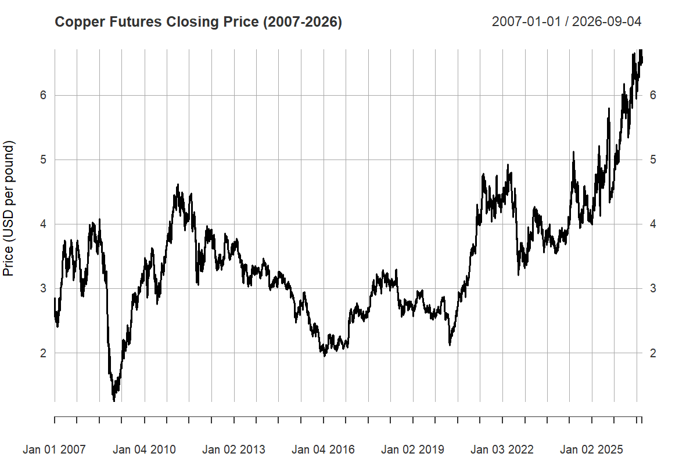
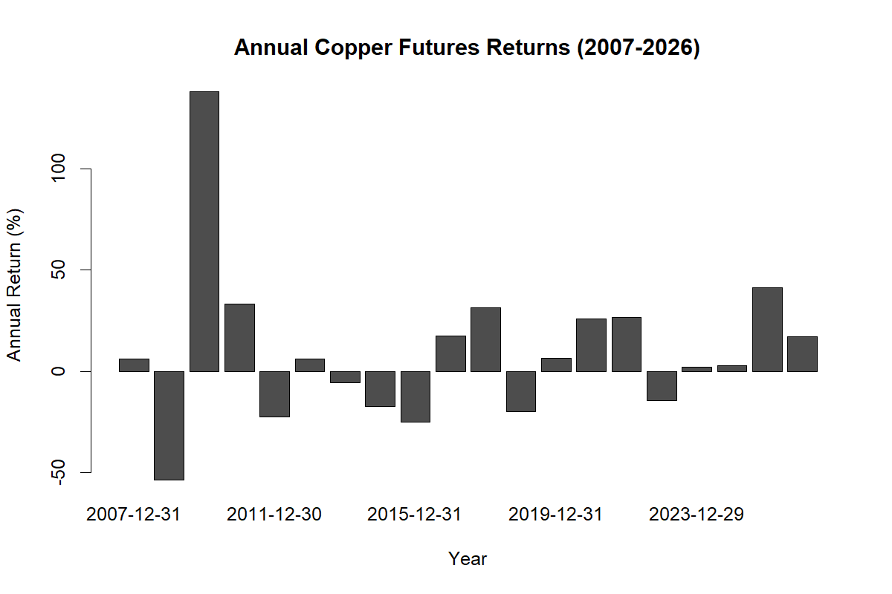
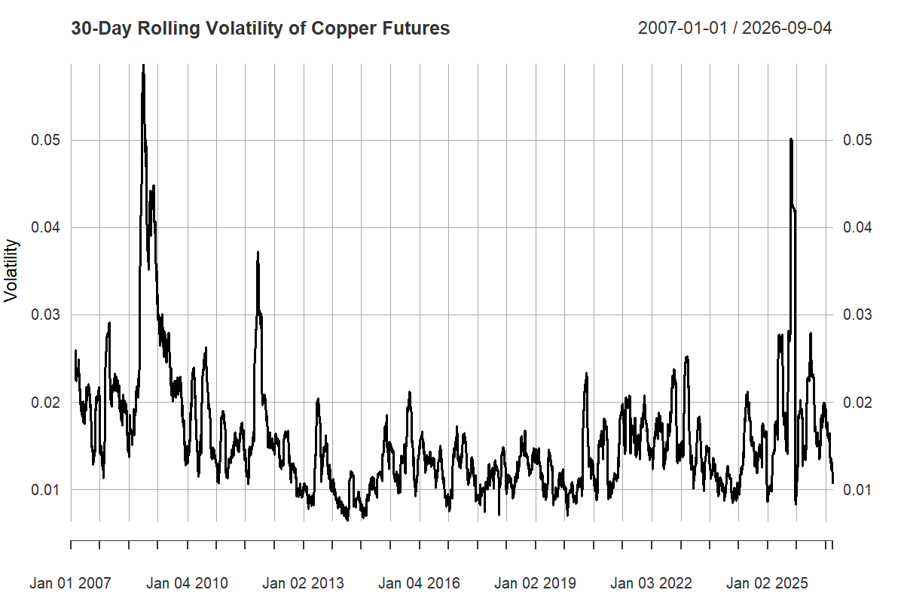
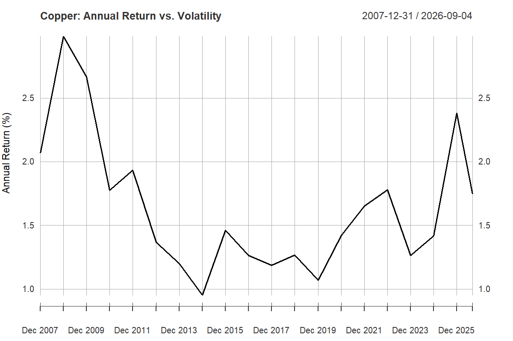

# Copper Market Risk and Volatility

### Quantitative Analysis of Copper Futures Prices, Returns and Volatility (2007-2026)
This project analyzes the historical behavior of copper futures prices using quantitative methods in R. The analysis examines daily returns, volatility, extreme price movements, and the relationship between annual returns and risk over the period from January 2007 to September 4, 2026.

The objective is to identify how copper-market risk changes across different market environments and translate these patterns into financially relevant insights.
📄 [Read the Full Report](Copper%20Analysis%20using%20R.pdf)

## Research Question
**How does copper-market risk evolve over time, and what patterns in its returns and volatility can be identified from historical data?**


## Objectives
The analysis focuses on four main areas:

- Examine the historical behavior of copper futures prices and daily returns.
- Measure how volatility changes across different market periods.
- Identify extreme daily price movements and downside risk.
- Examine the relationship between annual returns and annual volatility.


## Data & Methodology
The analysis uses daily copper futures data from Yahoo Finance for ticker **HG=F**, covering January 2007 through September 4, 2026.

| Item | Description |
|---|---|
| Instrument | Copper Futures (HG=F) |
| Data source | Yahoo Finance |
| Period | January 2007 – September 4, 2026 |
| Price measure | Daily closing price |
| Return measure | Daily arithmetic returns |
| Volatility measure | 30-day rolling standard deviation |
| Extreme movements | Daily returns with absolute values ≥ 5% |
| Downside risk | Standard deviation of negative daily returns |

The analysis was conducted in **R** using the `quantmod` package. Annual returns and volatility were also calculated to compare risk and performance across different market periods.

*Note: 2026 figures are year-to-date through September 4, 2026.*


## Key Findings
The analysis highlights several important patterns in copper-market risk:

- **High variability across market regimes:** Copper experienced major shifts in both returns and volatility over the 2007–2026 period.
- **2008–2009 reversal:** Annual returns fell by **53.97% in 2008** before rising by **138.53% in 2009**.
- **Time-varying volatility:** Annual volatility ranged from **0.95% in 2014** to **2.99% in 2008**, while 30-day rolling volatility reached **5.87%** in November 2008.
- **Recent performance:** Copper returned **41.24% in 2025** and **17.18% year-to-date in 2026** through September 4.
- **Weak return–risk relationship:** Annual returns and annual volatility had a correlation of **0.236**, indicating that higher volatility did not consistently correspond to higher returns.
- **Extreme price movements:** **79 daily observations** recorded absolute returns of at least 5%, with approximately **58% occurring during 2008–2009**.

Overall, the results indicate that copper-market risk is **time-varying rather than constant**, with the magnitude of risk changing substantially across different market environments.


## Visualizations

### Copper Futures Closing Price


### Annual Copper Futures Returns


### 30-Day Rolling Volatility


### Annual Return vs. Volatility



## Tools & Technologies
- **R** — Statistical analysis and data processing
- **RStudio** — Development environment
- **quantmod** — Financial data analysis
- **Yahoo Finance** — Historical copper futures data
- **Git & GitHub** — Version control and project repository


## Repository Structure
```text
copper-market-risk-analysis/
├── R
├── figures/
├── Copper Analysis using R.pdf
├── .gitignore
├── R project.Rproj
└── README.md
```


## Limitations

- The analysis uses **copper futures** rather than spot prices, so futures-market characteristics may affect the results.
- The analysis is historical and does not provide forecasts of future returns or volatility.
- The study focuses primarily on price and return data and does not explicitly model factors such as inventories, demand, interest rates, or supply disruptions.
- Results may differ from other data providers because of differences in data methodology and futures contract treatment.


## Data Source & Project Information

**Data source:** Yahoo Finance — Copper Futures (HG=F)

**Analysis period:** January 2007 – September 4, 2026

The project was developed in R as an independent quantitative finance portfolio project, focusing on historical copper-market risk, return behavior, and volatility.


## Conclusion
This analysis shows that copper-market risk changes substantially across different market environments. Historical returns and volatility reveal periods of severe stress, strong recovery, and renewed price appreciation, while the weak relationship between annual returns and volatility indicates that higher risk has not consistently produced higher returns.

